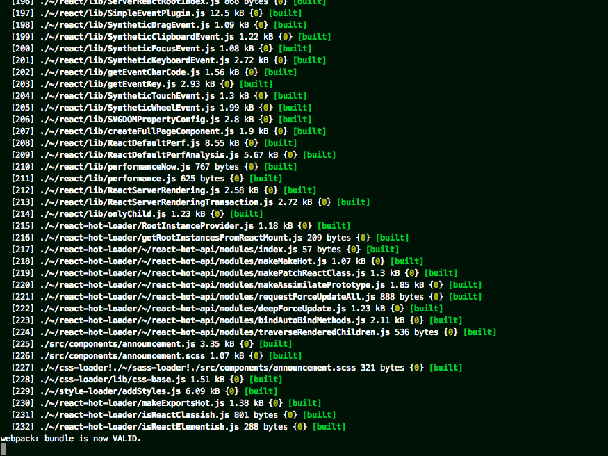
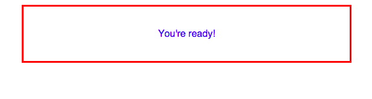

Hi! So you're coming to the [**Hands on with the modern front end stack**](http://www.phpconference.nl/schedule#tutorial-day/hands-modern-front-end-stack) workshop at Dutch PHP Conference?

**You'll need to bring a laptop capable of running this project as per the instructions below.** This project ensures you can install & run the tools we'll be using in the workshop.

## Setup instructions

- Install [Node.js](https://nodejs.org/). You can download the installer from the website, or alternatively use a tool like [nodenv](https://github.com/wfarr/nodenv) or [nvm](https://github.com/creationix/nvm) to install & manage Node versions. 
- Run `node -v` in your terminal to ensure it's installed. You should see something like:
  
  ```bash
  $ node -v
  v0.12.4
  ```
- Clone or download this repo, `cd` into it & run `npm install` to install dependencies.
- Run `npm start`. This will start a [Webpack dev server](http://webpack.github.io/docs/webpack-dev-server.html). You should see something like this in your terminal if it started correctly:

  

- Open [http://localhost:3000](http://localhost:3000) in your browser. You should see something like this:

  
  
- That's it! You're ready for the workshop!

### If you encounter problems

If you're getting an error, do a quick Google or StackOverflow search. If you can't find a solution, open an issue on this repo and I'll help you figure it out!

I'm a Mac user. If you're on Windows, please double check you can run this project prior to attending the workshop & let me know if you can't - I won't be much help if you have any Node/Windows issues on the day! :smile: 
